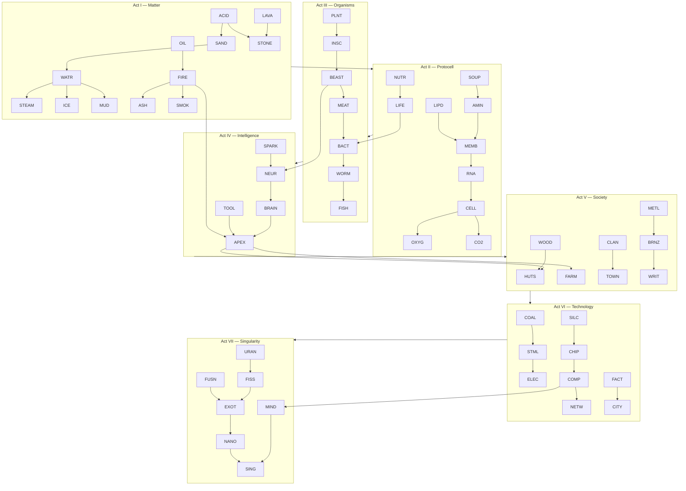

# Element Interaction Map & Incremental Unlock Route

Implementation guide for simulation rules and progression. Each **milestone** gates element unlocks; elements unlock **reactions** that enable the next milestone.

Companion: [Powder Incremental Game Design](powder-incremental-game-design.md)

---

## Table of Contents

1. [Milestone Ladder (Acts I–VII)](#1-milestone-ladder-acts-ivii)
2. [Incremental Unlock Route](#2-incremental-unlock-route)
3. [Master Interaction Map](#3-master-interaction-map)
4. [Reaction Registry (Simulation Rules)](#4-reaction-registry-simulation-rules)
5. [Per-Element Simulation Rules](#5-per-element-simulation-rules)
6. [Milestone Win Conditions](#6-milestone-win-conditions)
7. [Data Schema for Godot](#7-data-schema-for-godot)

---

## 1. Milestone Ladder (Acts I–VII)

```
ACT I          ACT II           ACT III          ACT IV
Reactions  →   Cellular Life →  Organisms    →   Intelligent Life
(chemistry)    (protocell)      (multicellular)  (nervous system)

ACT V              ACT VI              ACT VII
Society        →   Advanced Society →  The Singularity
(settlement)       (industry/tech)      (transcendence)
```

| Act | Milestone name | Player fantasy | New simulation capability |
|-----|----------------|----------------|---------------------------|
| **I** | **Create Reactions** | "I made matter change" | Phase change, combustion, dissolution, synthesis |
| **II** | **Create Cellular Life** | "Something alive at the smallest scale" | Membrane, metabolism, replication (GOL-like) |
| **III** | **Create Organisms** | "Bodies that eat, move, die" | Motile life, organs, food webs |
| **IV** | **Create Intelligent Life** | "It learns and uses tools" | Neurons, stimulus response, fire/tool use |
| **V** | **Create Society** | "They live together" | Structures, farming, population clusters |
| **VI** | **Create Advanced Society** | "Cities and machines" | Electricity, industry, computation |
| **VII** | **Create the Singularity** | "Mind escapes matter" | Fusion, exotic matter, AI cascade |

### Currency gates per act

| Act | Insight cost to enter | Prestige layer unlocked |
|-----|----------------------|-------------------------|
| I | 0 (start) | — |
| II | 500 | — |
| III | 5,000 | Spark (tutorial reset) |
| IV | 50,000 | Nova I |
| V | 500,000 | Nova II |
| VI | 5,000,000 | Nova III |
| VII | 50,000,000 | Singularity (final prestige) |

---

## 2. Incremental Unlock Route

Elements unlock in strict order. **Bold** = milestone-critical element.

### Act I — Create Reactions

| Order | ID | Name | Unlock trigger | Insight cost |
|-------|-----|------|----------------|--------------|
| 0 | `SAND` | Sand | Start | 0 |
| 1 | `WALL` | Wall | Complete tutorial run | 25 |
| 2 | **`WATR`** | Water | Place 50 sand in one run | 50 |
| 3 | `STONE` | Stone | Discover density (sand sinks in water) | 75 |
| 4 | **`FIRE`** | Fire | Unlock Combustion research node | 100 |
| 5 | `STEAM` | Steam | Witness water boil (auto-unlock with Phase Change) | — |
| 6 | `ICE` | Ice | Witness water freeze | — |
| 7 | `SMOK` | Smoke | Sustain fire 5s | 80 |
| 8 | `OIL` | Oil | Unlock Density research node | 120 |
| 9 | `LAVA` | Lava | Heat stone + fire proximity | 150 |
| 10 | `ACID` | Acid | 10 total reactions discovered | 200 |
| 11 | `ASH` | Ash | Burn wood or plant (previews Act II) | — |
| 12 | `SALT` | Salt | Evaporate salt water (brine chain) | 100 |
| 13 | `MUD` | Mud | Reaction: water + sand | — |
| 14 | `CLAY` | Clay | Reaction: mud + heat | 150 |
| 15 | `BRIM` | Brimstone | Fire + stone + oil sustained | 250 |
| 16 | **`SPARK`** | Lightning | Act I boss: 5 distinct reaction types in one run | 500 |

**Act I complete when:** Player triggers **15 unique reactions** and sustains a **fire–water–steam cycle** for 30s.

---

### Act II — Create Cellular Life

| Order | ID | Name | Unlock trigger | Insight cost |
|-------|-----|------|----------------|--------------|
| 17 | `MINR` | Mineral | Dissolve salt in water over stone | 300 |
| 18 | **`SOUP`** | Primordial Soup | Heat mud + mineral + water 20s | 500 |
| 19 | `AMIN` | Amino Acid | SOUP + heat + catalyst (BRIM) | 400 |
| 20 | `LIPD` | Lipid | SOUP + OIL + heat (after AMIN exists) | 400 |
| 21 | **`MEMB`** | Membrane | AMIN + LIPD adjacent 10s | 600 |
| 22 | `RNA` | RNA | MEMB encapsulates SOUP 30s | 800 |
| 23 | **`CELL`** | Protocell | RNA replicates 50 ticks inside MEMB | 1,000 |
| 24 | `OXYG` | Oxygen | CELL survives 60s (metabolism byproduct) | — |
| 25 | `CO2` | Carbon Dioxide | CELL respiration | — |
| 26 | `NUTR` | Nutrient Gel | ASH + SOUP + water | 300 |
| 27 | **`LIFE`** | Living Cell | CELL + NUTR + OXYG stable 120s | 2,000 |

**Act II complete when:** **LIFE** count ≥ 10 cells sustained 180s with OXYG/CO2 exchange.

---

### Act III — Create Organisms

| Order | ID | Name | Unlock trigger | Insight cost |
|-------|-----|------|----------------|--------------|
| 28 | `BACT` | Bacteria | LIFE divides in nutrient-rich mud | 1,500 |
| 29 | `ALGA` | Algae | BACT + light + water (CO2→OXYG) | 2,000 |
| 30 | `PLNT` | Plant | Root growth in mud (Sandspiel model) | 1,000 |
| 31 | `SEED` | Seed | PLNT dies → drops SEED | — |
| 32 | `FUNG` | Fungus | BACT + dead PLNT | 1,500 |
| 33 | **`WORM`** | Worm | BACT colony + NUTR forms motile chain | 3,000 |
| 34 | `INSC` | Insect | WORM + PLNT + OXYG ecosystem 60s | 4,000 |
| 35 | `FISH` | Fish | WORM in water + algae 90s | 5,000 |
| 36 | `BONE` | Bone | MINR deposit in organism death site | — |
| 37 | `MEAT` | Meat | Organism death residue | — |
| 38 | **`BEAST`** | Land Animal | INSC + MEAT + PLNT food web 120s | 8,000 |

**Act III complete when:** Food web of ≥3 organism types (PLNT → INSC → BEAST) stable 300s.

---

### Act IV — Create Intelligent Life

| Order | ID | Name | Unlock trigger | Insight cost |
|-------|-----|------|----------------|--------------|
| 39 | `NEUR` | Neuron | BEAST + electrical SPARK exposure | 10,000 |
| 40 | **`BRAIN`** | Brain Tissue | NEUR cluster ≥ 20 cells | 15,000 |
| 41 | `STIM` | Stimulus | BRAIN reacts to heat/cold at distance | — |
| 42 | `WOOD` | Wood | PLNT lignification (upgrade) | 2,000 |
| 43 | `TOOL` | Tool Stone | BEAST + STONE + BRAIN proximity | 5,000 |
| 44 | **`APEX`** | Sapient | BRAIN + TOOL + FIRE controlled 60s | 25,000 |
| 45 | `BLOOD` | Blood | BEAST circulatory (visual layer) | — |
| 46 | `EGGS` | Eggs | APEX reproduction | 8,000 |

**Act IV complete when:** **APEX** uses fire without self-immolation and places TOOL near food source (scripted behavior threshold).

---

### Act V — Create Society

| Order | ID | Name | Unlock trigger | Insight cost |
|-------|-----|------|----------------|--------------|
| 47 | `HUTS` | Hut | APEX + WOOD + MUD | 20,000 |
| 48 | `PATH` | Path | 3+ HUTS connected | 15,000 |
| 49 | `FARM` | Farm Plot | APEX + PLNT + enclosed WALL | 25,000 |
| 50 | **`CLAN`** | Population | 5 APEX near FARM 180s | 50,000 |
| 51 | `METL` | Metal Ore | Heat STONE + BRIM in CLAY crucible | 30,000 |
| 52 | `BRNZ` | Bronze | METL + FIRE + CLAY | 40,000 |
| 53 | `WRIT` | Writing | CLAN + BRNZ + pigment (ASH+CLAY) | 60,000 |
| 54 | `TOTL` | Totem | WRIT + HUTS cluster | 50,000 |
| 55 | **`TOWN`** | Town | CLAN ≥ 20 + FARM + PATH network | 100,000 |

**Act V complete when:** **TOWN** sustains population without starvation 600s.

---

### Act VI — Create Advanced Society

| Order | ID | Name | Unlock trigger | Insight cost |
|-------|-----|------|----------------|--------------|
| 56 | `COAL` | Coal | Compress PLNT + heat + pressure | 80,000 |
| 57 | `IRON` | Iron | METL smelt upgrade | 100,000 |
| 58 | `STML` | Steam | COAL + WATR + IRON vessel | 120,000 |
| 59 | `WIRE` | Wire | IRON drawn | 100,000 |
| 60 | **`ELEC`** | Electricity | WIRE + STML generator + SPARK | 200,000 |
| 61 | `SILC` | Silicon | Sand purified (SAND + ACID + heat) | 150,000 |
| 62 | `CHIP` | Microchip | SILC + ELEC + etched ACID pattern | 300,000 |
| 63 | `FACT` | Factory | CHIP + IRON + STML | 400,000 |
| 64 | `ROAD` | Road | TOWN upgrade + STONE + BRNZ | 200,000 |
| 65 | **`CITY`** | City | FACT + TOWN + ELEC grid 900s | 500,000 |
| 66 | `COMP` | Computer | CHIP cluster + ELEC sustained | 600,000 |
| 67 | `NETW` | Network | Multiple COMP linked | 800,000 |

**Act VI complete when:** **CITY** runs COMP that processes ≥ 1M "operations" (tick counter).

---

### Act VII — Create the Singularity

| Order | ID | Name | Unlock trigger | Insight cost |
|-------|-----|------|----------------|--------------|
| 68 | `URAN` | Uranium | Deep stone + NEUT exposure (prestige craft) | 1,000,000 |
| 69 | `FISS` | Fission | URAN + NEUT + controlled WALL | 1,500,000 |
| 70 | `FUSN` | Fusion | HYGN + heat + pressure endgame | 2,000,000 |
| 71 | `EXOT` | Exotic Matter | FISS + FUSN + COMP overflow | 3,000,000 |
| 72 | `NANO` | Nanite | EXOT + CHIP self-replication | 4,000,000 |
| 73 | **`MIND`** | Uploaded Mind | COMP + NETW + APEX pattern scan | 5,000,000 |
| 74 | `VOID` | Void Lattice | EXOT crystallization | 6,000,000 |
| 75 | **`SING`** | Singularity | MIND + NANO + EXOT cascade 60s | 10,000,000 |

**Act VII complete when:** **SING** event triggers — game enters epilogue prestige with infinite sandbox mode.

---

## 3. Master Interaction Map

### 3.1 Category graph (what can touch what)



### 3.2 Interaction matrix legend

| Symbol | Meaning |
|--------|---------|
| `→` | A transforms or produces B on contact |
| `↔` | Bidirectional exchange (both change) |
| `↑` | A rises through / floats on B (density) |
| `↓` | A sinks through B |
| `✕` | A destroys B |
| `⊕` | A + B → new element C |
| `°` | Phase change (temp-driven) |
| `◎` | Sustained proximity (timer-based) |
| `⚡` | Requires spark / electricity |
| `🔥` | Requires heat |

### 3.3 Act I reaction map (matter)

| A \ B | WATR | FIRE | ICE | OIL | LAVA | ACID | SAND | STONE | STEAM |
|-------|------|------|-----|-----|------|------|------|-------|-------|
| **SAND** | ↓ mud | — | — | — | ✕ melt | ✕ dissolve | piles | — | — |
| **WATR** | pools | ✕→STEAM | °→ICE | ↑ float | ✕→STEAM | dilute | ⊕→MUD | wet | ° condense |
| **FIRE** | ✕ out | spreads | ° melt | 🔥 spread | — | — | — | — | — |
| **OIL** | ↑ | 🔥→SMOK | — | pools | 🔥 | — | — | — | — |
| **LAVA** | ✕→STONE+STEAM | — | ° | ↓ | — | — | ↓ | ⊕→STONE | — |
| **ACID** | — | — | — | — | — | — | ✕ | ✕ | — |
| **CLAY** | ⊕→mud | harden | — | — | 🔥 brick | — | — | — | — |
| **SALT** | ⊕→brine | — | — | — | — | — | — | — | — |

### 3.4 Act II reaction map (protocell)

| A \ B | SOUP | AMIN | LIPD | MEMB | RNA | CELL | OXYG | CO2 | NUTR | HEAT |
|-------|------|------|------|------|-----|------|------|-----|------|------|
| **SOUP** | — | °◎→AMIN | — | — | — | — | — | — | — | catalyze |
| **AMIN** | — | — | ⊕→MEMB | ◎ | — | — | — | — | — | denature |
| **LIPD** | — | ⊕→MEMB | — | ◎ | — | — | — | — | — | melt |
| **MEMB** | encapsulate | ◎ | ◎ | — | ⊕→RNA | — | permeable | — | — | rupture |
| **RNA** | — | — | — | inside | replicates | ⊕→CELL | — | — | — | mutate |
| **CELL** | absorb | — | — | — | — | divide | consume | produce | ⊕→LIFE | die |
| **NUTR** | enrich | — | — | — | — | feed | — | — | — | — |
| **LIFE** | — | — | — | — | — | divide | need | emit | eat | — |

### 3.5 Act III reaction map (organisms)

| A \ B | BACT | ALGA | PLNT | WORM | INSC | FISH | BEAST | MEAT | DEAD |
|-------|------|------|------|------|------|------|-------|------|------|
| **BACT** | colony | — | rot | ⊕→WORM | — | — | — | consume | consume |
| **PLNT** | — | — | grow | food | food | — | food | — | ⊕→ASH |
| **WORM** | — | — | eat | — | evolve | ⊕→FISH | — | — | — |
| **INSC** | — | — | eat | — | — | — | ⊕→BEAST | — | — |
| **BEAST** | — | — | eat | eat | eat | eat | herd | ⊕→MEAT | — |
| **MEAT** | rot | — | — | — | — | — | — | — | ⊕→BACT |
| **WATER** | swim | grow | grow | swim | — | swim | drink | — | — |
| **MUD** | breed | anchor | root | tunnel | — | — | — | — | — |

### 3.6 Act IV reaction map (intelligence)

| A \ B | NEUR | BRAIN | BEAST | FIRE | TOOL | STIM | SPARK | APEX |
|-------|------|-------|-------|------|------|------|-------|------|
| **NEUR** | connect | ⊕→BRAIN | grows in | damage | — | — | ⚡ excite | — |
| **BRAIN** | — | network | ⊕→APEX | learn | use | respond | ⚡ think | — |
| **SPARK** | ⚡→NEUR | ⚡ | damage | ignite | — | trigger | — | inspire |
| **TOOL** | — | extend | — | control | — | — | — | ⊕→APEX |
| **FIRE** | — | fear/learn | threat | spread | create | light | — | master |
| **APEX** | — | has | is | uses | wields | senses | — | social |

### 3.7 Act V–VI reaction map (society & technology)

| A \ B | HUTS | FARM | METL | BRNZ | ELEC | CHIP | COMP | CITY |
|-------|------|------|------|------|------|------|------|------|
| **APEX** | build | work | mine | craft | maintain | program | operate | inhabit |
| **WOOD** | ⊕→HUTS | fence | — | fuel | — | — | — | build |
| **METL** | — | tool | — | ⊕→BRNZ | ⊕→WIRE | etch | — | — |
| **COAL** | heat | — | smelt | — | ⚡→ELEC | — | power | power |
| **STML** | — | — | forge | — | ⚡→ELEC | cool | — | — |
| **SILC** | — | — | — | — | dope | ⊕→CHIP | — | — |
| **CHIP** | — | — | — | — | need | array | ⊕→COMP | — |
| **COMP** | — | automate | — | — | need | — | network | ⊕→CITY |

### 3.8 Act VII reaction map (singularity)

| A \ B | URAN | FISS | FUSN | EXOT | NANO | MIND | COMP | SING |
|-------|------|------|------|------|------|------|------|------|
| **URAN** | — | ⊕→FISS | — | — | — | — | power | — |
| **FISS** | chain | — | — | ⊕→EXOT | — | — | overload | — |
| **FUSN** | — | — | — | ⊕→EXOT | — | — | — | — |
| **EXOT** | — | — | — | replicate | ⊕→NANO | substrate | merge | ⊕→SING |
| **NANO** | — | — | — | spread | — | interface | consume | ⊕→SING |
| **MIND** | — | — | — | upload | ⊕→NANO | — | ⊕→MIND | ⊕→SING |
| **COMP** | calc | simulate | — | host | run | ⊕→MIND | network | trigger |
| **SING** | absorb | absorb | absorb | absorb | absorb | absorb | absorb | — |

---

## 4. Reaction Registry (Simulation Rules)

Machine-readable reaction list. Format:

```
[ACT] REACTANT_A + REACTANT_B → PRODUCT_A + PRODUCT_B | conditions
```

### Act I — Reactions (25 rules)

```
I   SAND   + WATR   → MUD    + null   | oneway, contact
I   WATR   + FIRE   → STEAM  + null   | temp>100, extinguishes fire cell
I   WATR   + LAVA   → STONE  + STEAM  | contact
I   WATR   + ICE    → ICE    + ICE    | temp<0, freeze water
I   ICE    + FIRE   → WATR   + null   | melt
I   OIL    + FIRE   → FIRE   + SMOK   | chance 0.3, burning
I   WOOD   + FIRE   → FIRE   + ASH    | chance 0.2, burning
I   PLNT   + FIRE   → FIRE   + ASH    | chance 0.25, burning
I   ACID   + STONE  → null   + null   | chance 0.05, dissolve
I   ACID   + SAND   → null   + null   | chance 0.08, dissolve
I   ACID   + METL   → null   + SMOK   | chance 0.1
I   SALT   + WATR   → BRINE  + null   | oneway
I   BRINE  + FIRE   → SALT   + STEAM  | evaporation, sustained 5s
I   MUD    + FIRE   → CLAY   + STEAM  | temp>200, sustained 3s
I   CLAY   + FIRE   → BRICK  + null   | temp>400, sustained 5s
I   SAND   + LAVA   → null   + LAVA   | chance 0.5, melt
I   STONE  + LAVA   → LAVA   + null   | chance 0.02, melt
I   FIRE   + SMOK   → SMOK   + null   | smoke rises
I   OIL    + WATR   → null   + null   | density swap only
I   SAND   + WATR   → null   + null   | density swap only
I   SPARK  + OIL    → FIRE   + null   | chance 1.0
I   SPARK  + GAS    → FIRE   + null   | chance 0.8
I   BRIM   + STONE  → null   + SMOK   | heat catalysis
I   WATR   + STEAM  → WATR   + null   | temp<100, condense
I   null   + null   → FIRE   + null   | SPARK + any flammable, see ignite table
```

### Act II — Protocell (15 rules)

```
II  SOUP   + HEAT   → AMIN   + null   | temp 60-90, chance 0.02
II  SOUP   + BRIM   → AMIN   + null   | catalyst, chance 0.05
II  AMIN   + LIPD   → MEMB   + null   | adjacent 10 ticks
II  SOUP   + MEMB   → RNA    + SOUP   | encapsulated, chance 0.01/tick
II  RNA    + NUTR   → CELL   + null   | inside MEMB, 50 ticks
II  CELL   + OXYG   → LIFE   + CO2    | metabolism, sustained
II  CELL   + null   → CELL   + CELL   | divide, chance 0.01, needs NUTR
II  LIFE   + null   → LIFE   + LIFE   | mitosis, chance 0.005, needs O2
II  LIFE   + ACID   → null   + NUTR   | death
II  LIFE   + FIRE   → null   + ASH    | death
II  LIFE   + no O2  → null   + NUTR   | suffocate, 30 ticks
II  PLNT   + WATR   → PLNT   + PLNT   | growth, see plant rules
II  ASH    + SOUP   → NUTR   + null   | chance 0.1
II  BACT   + NUTR   → BACT   + BACT   | binary fission, mud
II  ALGA   + CO2    → OXYG   + ALGA   | photosynthesis, light>0.5
```

### Act III — Organisms (12 rules)

```
III WORM   + NUTR   → WORM   + WORM   | growth, chance 0.02
III WORM   + PLNT   → WORM   + null   | consume
III INSC   + PLNT   → INSC   + null   | consume, chance 0.1
III INSC   + MEAT   → INSC   + INSC   | reproduce, chance 0.01
III FISH   + ALGA   → FISH   + FISH   | reproduce, water only
III BEAST  + INSC   → BEAST  + BEAST  | reproduce, chance 0.005
III BEAST  + MEAT   → BEAST  + null   | consume
III BEAST  + PLNT   → BEAST  + null   | consume
III BEAST  + null   → MEAT   + BONE   | death
III MEAT   + BACT   → null   + BACT   | rot spreads
III FUNG   + WOOD   → FUNG   + FUNG   | spread
III SEED   + MUD+WATR → PLNT + ROOT  | sustained 20 ticks
```

### Act IV — Intelligence (10 rules)

```
IV  BEAST  + SPARK  → NEUR   + null   | rare, chance 0.001
IV  NEUR   + NEUR   → BRAIN  + null   | cluster >= 20
IV  BRAIN  + FIRE   → BRAIN  + STIM   | learn fire, once
IV  BRAIN  + TOOL   → APEX   + null   | sustained 60 ticks
IV  APEX   + FIRE   → null   + STIM   | controlled fire, mastery
IV  APEX   + PLNT   → APEX   + null   | farm behavior
IV  APEX   + MEAT   → APEX   + null   | hunt behavior
IV  APEX   + null   → EGGS   + null   | reproduce, needs FARM
IV  BRAIN  + STIM   → NEUR   + null   | reinforce pathway
IV  SPARK  + BRAIN  → BRAIN  + STIM   | insight flash
```

### Act V — Society (10 rules)

```
V   APEX   + WOOD   → HUTS   + null   | build, 30 ticks proximity
V   APEX   + MUD    → HUTS   + null   | build
V   HUTS   + HUTS   → PATH   + null   | auto, distance < 20
V   APEX   + PLNT+FARM → FARM + null  | plant crop
V   APEX   + FARM   → CLAN   + null   | 5 apex, 180s
V   METL   + FIRE+CLAY → BRNZ + null   | smelt
V   BRNZ   + ASH    → WRIT   + null   | pigment writing
V   CLAN   + WRIT   → TOTL   + null   | culture marker
V   CLAN   + FARM+PATH → TOWN + null  | population >= 20
V   TOWN   + STARVE → MEAT   + null   | failure state
```

### Act VI — Technology (12 rules)

```
VI  PLNT   + HEAT+PRESS → COAL  + null  | compress
VI  METL   + COAL+FIRE  → IRON  + null  | smelt
VI  IRON   + WATR+COAL  → STML  + null  | boiler
VI  STML   + WIRE       → ELEC  + null  | generator
VI  SAND   + ACID+HEAT  → SILC  + null  | purify
VI  SILC   + ACID pattern → CHIP + null | etch, needs ELEC
VI  CHIP   + ELEC       → COMP  + null  | assemble
VI  COMP   + COMP       → NETW  + null  | link
VI  FACT   + TOWN       → CITY  + null  | industrialize
VI  ELEC   + WATR       → STEAM + ELEC  | turbine
VI  COMP   + APEX data  → MIND  + null  | scan, Act VII bridge
VI  CITY   + NETW       → COMP  + null  | upgrade loop
```

### Act VII — Singularity (8 rules)

```
VII URAN   + NEUT     → FISS  + HEAT   | controlled
VII FISS   + WALL     → EXOT  + null   | containment breach ok
VII HYGN   + FUSN     → EXOT  + HEAT   | fusion
VII EXOT   + COMP     → NANO  + null   | grey goo start
VII NANO   + any      → NANO  + NANO   | replicate, chance 0.1
VII MIND   + NETW     → MIND  + MIND   | merge
VII MIND   + EXOT+NANO → SING + null   | cascade 60s
VII SING   + any      → VOID  + null   | absorb all, ending
```

**Total: 92 registered reactions** across 75 element types.

---

## 5. Per-Element Simulation Rules

### Behavior classes

| Class | Update rule | Examples |
|-------|-------------|----------|
| `POWDER` | Fall ↓, slide ↘↙ if blocked | SAND, ASH, SALT |
| `LIQUID` | Fall ↓, spread ↔, pool | WATR, OIL, ACID, SOUP |
| `GAS` | Rise ↑, diffuse | STEAM, SMOK, OXYG, CO2 |
| `SOLID` | Static unless eroded | STONE, WALL, BRICK |
| `ENERGY` | Spread, decay timer | FIRE, SPARK, ELEC |
| `LIFE` | Metabolize, divide, die | CELL, BACT, PLNT, WORM, APEX |
| `STRUCTURE` | Static, interact with APEX | HUTS, FARM, FACT, CITY |
| `TECH` | Requires power input | CHIP, COMP, NETW |
| `EXOTIC` | Non-standard physics | EXOT, NANO, SING, VOID |

### Priority update order (per tick)

1. EXOTIC / ENERGY (SING, NANO, FIRE, ELEC, SPARK)
2. GAS (rise)
3. LIFE (metabolism, movement)
4. LIQUID (fall, spread)
5. POWDER (fall)
6. STRUCTURE / TECH (passive)
7. SOLID (static)

Within each class: **bottom row → top row** (gravity).

### Key element specs

| ID | Class | Density | Flammable | Conducts | Special |
|----|-------|---------|-----------|----------|---------|
| SAND | POWDER | 5 | no | no | — |
| WATR | LIQUID | 4 | no | no | freeze 0, boil 100 |
| FIRE | ENERGY | 1 | — | no | decay 30-80 ticks |
| CELL | LIFE | 4 | yes | no | needs O2, divides |
| WORM | LIFE | 4 | no | no | crawls ↓↔ in mud/water |
| NEUR | LIFE | 3 | no | yes | connects to NEUR |
| APEX | LIFE | 5 | no | no | AI state machine |
| HUTS | STRUCTURE | 8 | yes | no | houses 3 APEX |
| ELEC | ENERGY | — | — | yes | flows WIRE |
| CHIP | TECH | 7 | no | yes | needs ELEC |
| EXOT | EXOTIC | 0 | no | no | anti-gravity, clone |
| SING | EXOTIC | — | — | — | absorbs all, win state |

### APEX behavior state machine (Act IV+)

```
IDLE → (hungry) → SEEK_FOOD → (found PLNT/MEAT) → EAT
     → (cold)    → SEEK_FIRE  → (found FIRE)     → WARM
     → (threat)  → FLEE
     → (BRAIN+TOOL) → BUILD → place HUTS/FARM
     → (COMP nearby) → PROGRAM → contribute to MIND
```

### LIFE / GOL hybrid rules (Act II)

Protocell uses simplified Conway rules on `LIFE` element only:

- **Birth:** dead cell with exactly 3 LIFE neighbors → LIFE
- **Survival:** LIVE cell with 2-3 LIFE neighbors survives
- **Death:** otherwise → NUTR (food for next cycle)

Requires OXYG adjacent every 10 ticks or cell dies (metabolism overlay).

---

## 6. Milestone Win Conditions

| Act | Milestone | Detection rule | Reward |
|-----|-----------|----------------|--------|
| I | Create Reactions | `unique_reactions >= 15` AND `steam_cycle_30s` | Unlock Act II tree; +500 Insight |
| II | Create Cellular Life | `life_count >= 10` sustained 180s with O2/CO2 | Unlock Act III; Spark prestige |
| III | Create Organisms | `food_web_score >= 3` types, 300s stable | Unlock Act IV; Nova I |
| IV | Create Intelligent Life | `apex_fire_mastery` AND `apex_tool_use` | Unlock Act V; Nova II |
| V | Create Society | `town_population >= 20` no starvation 600s | Unlock Act VI; Nova III |
| VI | Create Advanced Society | `comp_ops >= 1_000_000` in CITY | Unlock Act VII |
| VII | Create the Singularity | `singularity_cascade 60s` | Ending + infinite sandbox |

### Scoring helpers

```gdscript
# food_web_score: count of organism types with pop >= 5 simultaneously
# steam_cycle_30s: water→steam→water loop detected
# apex_fire_mastery: APEX within 3 cells of FIRE without death, 60s
# singularity_cascade: SING absorbs >50% grid cells in 60s
```

---

## 7. Data Schema for Godot

### elements.json structure

```json
{
  "SAND": {
    "id": 1,
    "name": "Sand",
    "act": 1,
    "unlock_order": 0,
    "class": "POWDER",
    "density": 5,
    "color": "#c2b280",
    "flammable": false,
    "interactions": ["WATR:mud", "LAVA:melt", "ACID:dissolve"]
  }
}
```

### reactions.json structure

```json
{
  "id": "I_001",
  "act": 1,
  "elem1": "SAND",
  "elem2": "WATR",
  "result1": "MUD",
  "result2": null,
  "chance": 1.0,
  "oneway": true,
  "temp_min": null,
  "temp_max": null,
  "duration_ticks": 0,
  "milestone": "reactions"
}
```

### unlock_route.json structure

```json
{
  "act": 2,
  "milestone": "cellular_life",
  "elements": ["SOUP", "AMIN", "LIPD", "MEMB", "RNA", "CELL", "LIFE"],
  "prerequisite_milestone": "reactions",
  "insight_gate": 500
}
```

### Suggested autoload flow

```
ElementDB.load("elements.json")
ReactionDB.load("reactions.json")
UnlockDB.load("unlock_route.json")
MilestoneTracker.connect_to(SimEventBus)
```

On `reaction_discovered(reaction_id)`:
1. Mark reaction in journal
2. Check milestone progress
3. If gate met → `UnlockDB.unlock_next_elements()`

---

## Quick Reference: Full Unlock Order (75 elements)

```
 1 SAND    11 ASH     21 MEMB    31 SEED    41 STIM    51 METL    61 SILC    71 EXOT
 2 WALL    12 SALT    22 RNA     32 FUNG    42 WOOD    52 BRNZ    62 CHIP    72 NANO
 3 WATR    13 MUD     23 CELL    33 WORM    43 TOOL    53 WRIT    63 FACT    73 MIND
 4 STONE   14 CLAY    24 OXYG    34 INSC    44 APEX    54 TOTL    64 ROAD    74 VOID
 5 FIRE    15 BRIM    25 CO2     35 FISH    45 BLOOD    55 TOWN    65 CITY    75 SING
 6 STEAM   16 SPARK   26 NUTR    36 BONE    46 EGGS    56 COAL    66 COMP
 7 ICE     17 MINR    27 LIFE    37 MEAT    47 HUTS    57 IRON    67 NETW
 8 SMOK    18 SOUP    28 BACT    38 BEAST   48 PATH    58 STML    68 URAN
 9 OIL     19 AMIN    29 ALGA    39 NEUR    49 FARM    59 WIRE    69 FISS
10 LAVA    20 LIPD    30 PLNT    40 BRAIN   50 CLAN    60 ELEC    70 FUSN
```

---

## 8. Element Encyclopedia & Mastery System

### Dual progression (separate currencies)

| System | Currency | Purchases | Earned from |
|--------|----------|-----------|-------------|
| **Seismic Web** | Insight | New elements, timer, budget, brush, acts | Run events, milestones, reactions (one-time) |
| **Mastery Track** | Element XP (per element) | Per-element upgrades (spread, potency, efficiency) | Continued use of that element in runs |

The two systems must **never share a shop UI tab** — players should always know which currency they are spending.

### Encyclopedia visibility states

| State | Display | Condition |
|-------|---------|-----------|
| `DISCOVERED` | Full entry: name, color, stats, known reactions | Element placed or witnessed in sim |
| `UNLOCKED` | Full entry + mastery upgrades | Purchased via Insight (seismic shop) |
| `HINTED` | Silhouette + "?" + act teaser | Same act, not yet unlocked; player completed prior element |
| `LOCKED` | Grey card + "???" + act number only | Future act; shows milestone name as teaser |
| `REACTION_KNOWN` | Reaction row lit in journal | Pair triggered at least once |
| `REACTION_UNKNOWN` | `"? + ? → ?"` greyed | One or both elements discovered but reaction not seen |
| `REACTION_HIDDEN` | `"??? + ??? → ???"` | Elements not yet discovered |

### Encyclopedia UI sections

1. **Elements** — grid by act; filter discovered / all / unknown
2. **Reactions** — journal sorted by discovery date; link to element pages
3. **Milestones** — 7-act ladder with progress bars
4. **Mastery** — per-element upgrade tree (only for unlocked elements)

### Mastery XP formula

```
xp_gain_place = pixels_placed × (1 + mastery_level × 0.1)
xp_gain_react = 5 × (1 + mastery_level × 0.05)  # per element involved
xp_to_next_level = floor(50 × 1.18^level)
```

### Example element upgrades (Mastery currency)

| Element | Upgrade | Max | Effect |
|---------|---------|-----|--------|
| SAND | Fine Grains | 5 | +10% placement budget efficiency when placing sand |
| SAND | Heavy Pile | 3 | +1 density (sinks faster) |
| WATR | Surfactant | 5 | +8% spread rate per level |
| WATR | Electrolysis | 1 | Unlocks H₂/O₂ when seismic Electrolysis owned |
| FIRE | Intensity | 5 | +5% spread chance |
| FIRE | Duration | 5 | +4 ticks burn time |
| MUD | Fertility | 3 | Preview Act II SOUP catalyst bonus |

---

*Implementation map for the powder physics incremental game. Last updated: June 2026.*
